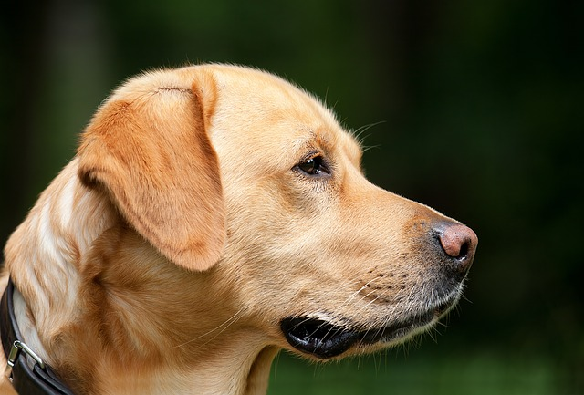

<h1>Dog</h1>

Labrador Retriever is a breed of dog. It was originally bred as hunting dogs. Labradors are used as guide dogs, rescue dogs. The breed originates on the island of Newfoundland on the east coast of Canada

